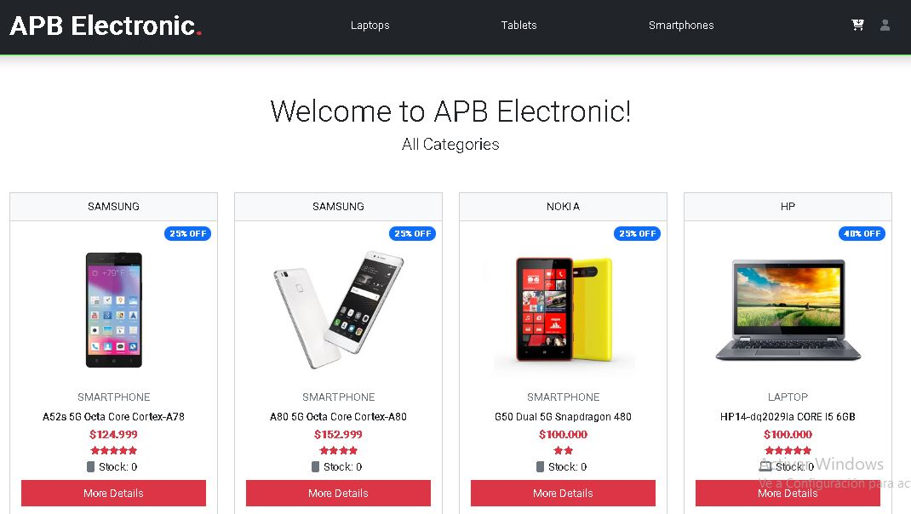
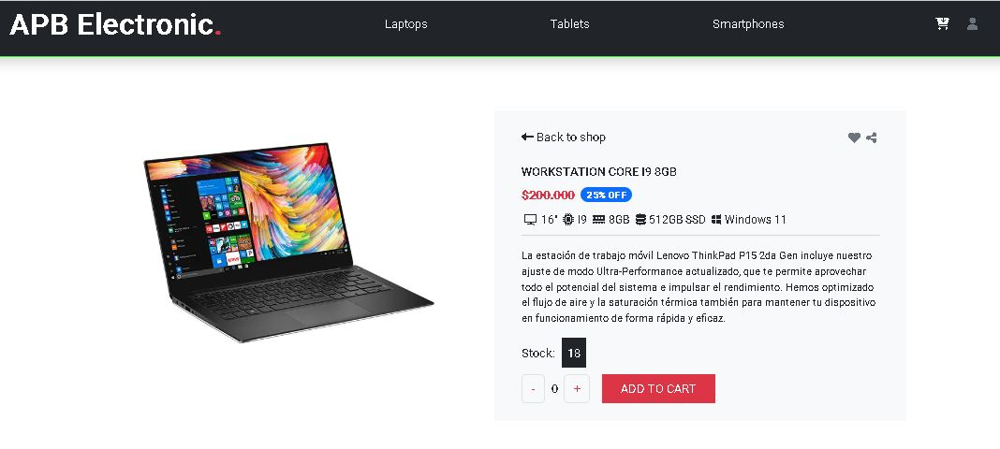
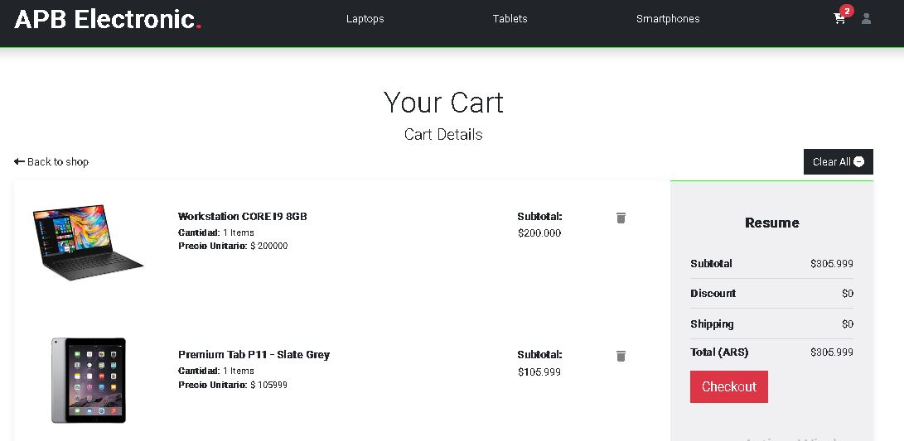

# Proyecto Tienda Online con React #34835
Proyecto Final de Tienda para el curso de React Js #34835 en Coderhouse.

## Detalles del Sitio:
- Se ingresa a la web y el usuario puede navegar por las diferentes categorias, ver los articulos e ingresar a los detalles.


- Al ingresar al detalle se puede visualizar: Descripcion foto, precio y stock disponible. incrementa o decrementa la cantidad deseada y al darle a "add to cart" y luego "Checkout" en el carrito.


- Al sumar cantidades al Carrito  lista los mismo y muestra un resumen de la compra, totalizando la compra. Si no se desea un articulo o vaciar el carrito mismo puede realizarlo. Muestra mensaje de Confirmacion la accion luego de realizada.

- Al cargar los datos del formulario de compra (Que se validan), se actulizan estos en la base de datos y arroja un numero de orden


## Para instalar localmente Instalación

```
  - Bajar el Zip o clonar el repositorio
  - npm install 
  - npm start
```

## Tecnologias Empeladas
- CSS
- HTML
- Google Fonts
- Bootstrap
- Javascript
- React
- React-router-dom
- Firebase
- Sweetalert 2
- Font awesome

## Desarrollado por:

- **Matias Ferrizo** 